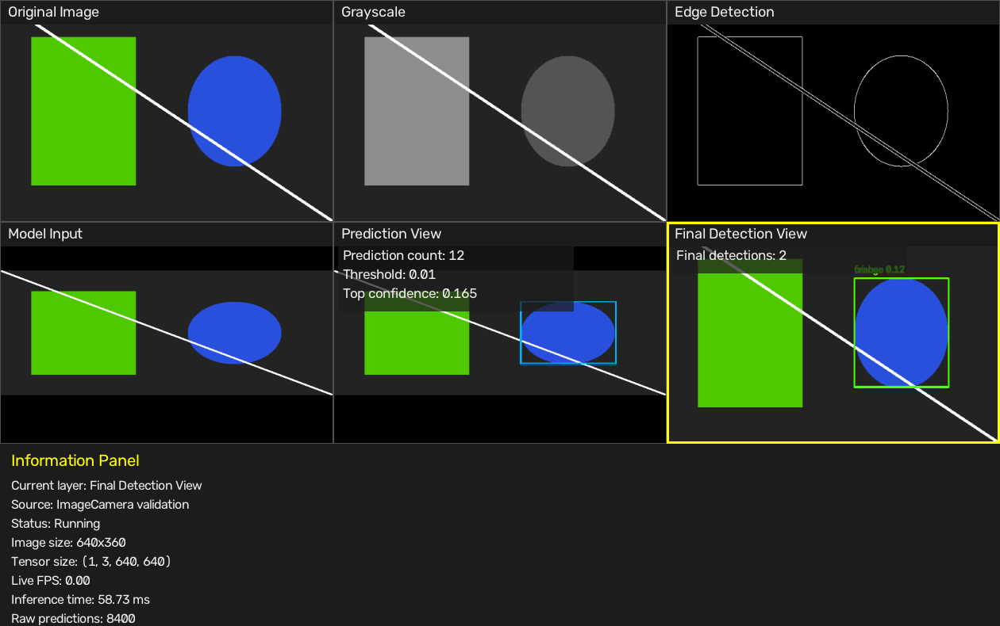

# 04 Perception Pipeline

## Purpose

This document explains how GuardianAI turns an image into final detections.

## Learning Objectives

You will learn:

- Why each perception module has one responsibility.
- How an image becomes a tensor.
- What raw ONNX output looks like.
- What a Prediction is.
- What a Detection is.
- Why Non-Maximum Suppression is needed.

## Hardware Requirements

Static image mode:

- macOS or Raspberry Pi
- Python 3
- OpenCV
- NumPy
- ONNX Runtime

Live camera mode:

- Raspberry Pi 4
- Raspberry Pi Camera Module
- Picamera2

## Pipeline Diagram

```text
ImageCamera or PiCamera
        |
        v
Preprocessor
        |
        v
InferenceEngine
        |
        v
Detector.decode()
        |
        v
Prediction objects
        |
        v
Detector.detect()
        |
        v
Detection objects
```

## Stage 1: Camera

Module:

```text
src/camera.py
```

Public API:

```python
start()
capture()
stop()
```

Implementations:

- `ImageCamera`: loads one image from disk.
- `OpenCVCamera`: desktop webcam support.
- `PiCamera`: Raspberry Pi camera through Picamera2.

Command using static image:

```bash
python3 -B apps/perception_dashboard.py --threshold 0.01
```

Command using Pi camera:

```bash
python3 -B apps/perception_dashboard.py --camera --object person --threshold 0.25
```

Expected observation:

- The rest of the pipeline does not care whether the source is an image or camera.

## Stage 2: Preprocessor

Module:

```text
src/preprocessing.py
```

Public API:

```python
Preprocessor().process(frame)
```

Steps:

1. Validate the input frame.
2. Convert grayscale or BGRA to BGR.
3. Letterbox resize to `640x640`.
4. Normalize pixel values from `0-255` to `0.0-1.0`.
5. Convert HWC to CHW.
6. Add batch dimension to produce NCHW.

Run:

```bash
python3 -B tests/test_preprocessing.py
```

Expected output:

```text
Original shape: (360, 640)
Model image shape: (640, 640, 3)
Tensor shape: (1, 3, 640, 640)
Scale: 1.0
Padding: pad_x=0, pad_y=140
```

Discussion prompt:

- Why would stretching an image be worse than padding it?

## Stage 3: InferenceEngine

Module:

```text
src/inference_engine.py
```

Public API:

```python
load(model_path)
infer(tensor)
```

The engine uses:

```text
ONNX Runtime CPUExecutionProvider
```

It returns:

```text
InferenceResult(raw_output, inference_ms)
```

Run:

```bash
python3 -B apps/inference_explorer.py models/object_detector.onnx
```

Expected output pattern:

```text
Model name: object_detector.onnx
Input tensor shape: (1, 3, 640, 640)
Output tensor shape: (1, 84, 8400)
Number of predictions: 8400
Values per prediction: 84
Tensor dtype: float32
Inference time: ...
```

Learning point:

- The neural network returns numbers, not object names.

## Stage 4: Prediction Decoding

Module:

```text
src/detector.py
```

Public API:

```python
Detector.decode(raw_output)
```

Prediction means:

```text
Raw neural-network hypothesis
```

Each prediction contains:

- Prediction index
- Best class ID
- Label
- Confidence
- Center x
- Center y
- Width
- Height

Run:

```bash
python3 -B apps/prediction_explorer.py --threshold 0.01
```

Expected output:

```text
Total raw predictions: 8400
Predictions above threshold: 12
Top 20 predictions:
Prediction index: ...
```

Discussion prompt:

- Why does the model create thousands of hypotheses for one image?

## Stage 5: Detection

Module:

```text
src/detector.py
```

Public API:

```python
Detector.detect(predictions, metadata)
```

Detection means:

```text
Final accepted object after NMS and coordinate restoration
```

Detection stages:

1. Sort predictions by confidence.
2. Convert center boxes to corner boxes.
3. Compare same-class boxes using IoU.
4. Remove lower-confidence duplicate boxes.
5. Restore model-input coordinates to original image coordinates.
6. Return `Detection` objects.

Run:

```bash
python3 -B apps/detection_explorer.py --threshold 0.01
```

Expected output:

```text
Stage 1
--------
Total raw hypotheses: 8400

Stage 4
--------
Predictions removed by NMS: 10

Stage 5
--------
Final Detection list
```

## IoU

IoU means Intersection over Union.

```text
IoU = overlap area / total combined area
```

If two boxes have IoU near `1.0`, they almost completely overlap.

If IoU is `0.0`, they do not overlap.

## NMS

NMS means Non-Maximum Suppression.

It removes duplicate predictions:

```text
High confidence box survives
Lower confidence overlapping box is removed
```

Example:

```text
Prediction 8194 removed.
Reason:
IoU 1.00 with Prediction 8214
Confidence lower
Prediction discarded.
```

## Troubleshooting

Problem:

```text
Unsupported YOLO output shape
```

Cause:

- The ONNX model output shape does not match `(1, 84, N)` or `(1, N, 84)`.

Fix:

- Confirm the model is a supported YOLO-style object detector.
- Run:

```bash
python3 -B apps/inference_explorer.py models/object_detector.onnx
```

Problem:

```text
Predictions above threshold: 0
```

Cause:

- Threshold may be too high for the test image.

Try:

```bash
python3 -B apps/prediction_explorer.py --threshold 0.01
```

## Screenshot Placeholders

Use these screenshots or placeholders when documenting perception validation:

Perception Dashboard:



Embedded Console:


Vision Explorer:

```text
[screenshot placeholder: images/vision_explorer_validation.png]
```

Prediction Explorer:

```text
[screenshot placeholder: images/prediction_explorer_validation.png]
```

Detection Explorer:

```text
[screenshot placeholder: images/detection_explorer_validation.png]
```
